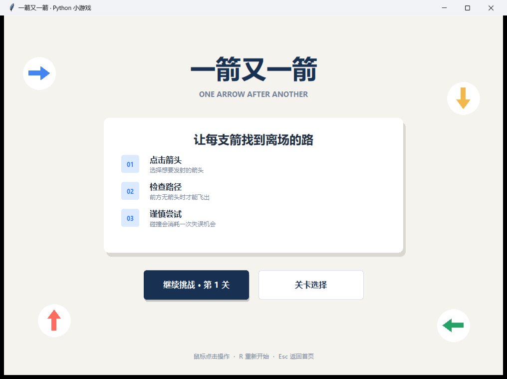
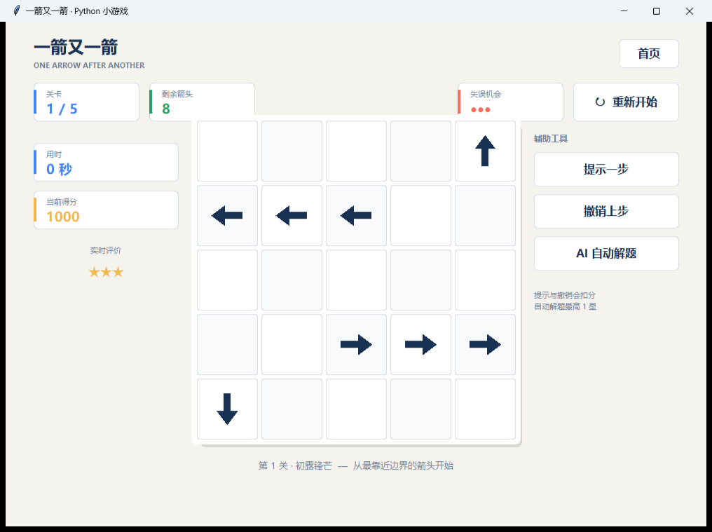
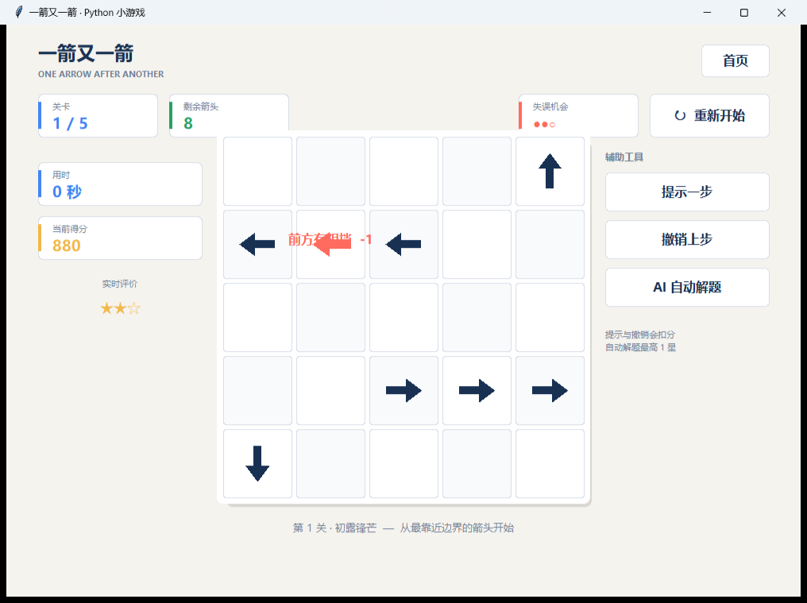
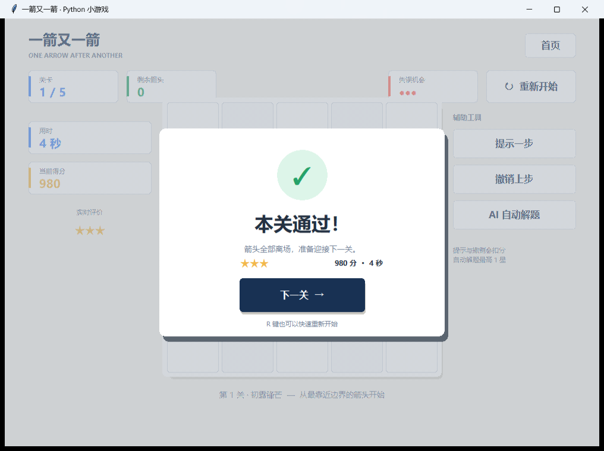
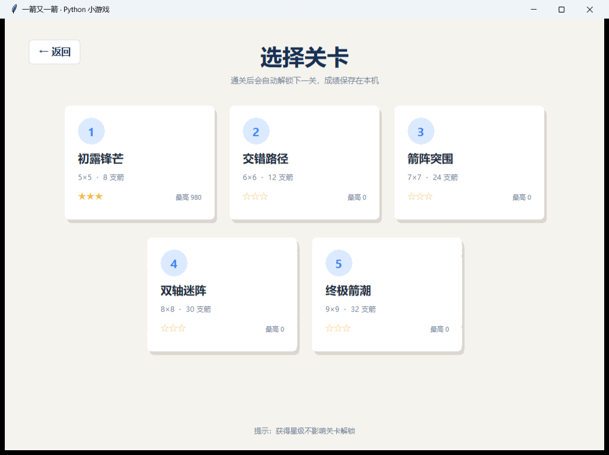

# 一箭又一箭（Python / Tkinter）

一个独立开发的网格箭头消除小游戏，只参考“点击箭头、检测前方路径”的基础玩法，不使用原游戏素材或代码。

## 运行截图

| 开始界面 | 游戏界面 |
|---|---|
|  |  |

| 碰撞反馈 | 通关界面 |
|---|---|
|  |  |



## 运行

环境要求：Python 3.10 或更高版本。程序只使用 Python 标准库，无需安装第三方包。

```bash
python one_arrow_after_another.py
```

Windows 也可以直接双击 `one_arrow_after_another.py`。如果电脑没有关联 `.py` 文件，请在该文件所在目录打开终端后使用上面的命令。

## 测试

```bash
python -m unittest tests.test_game -v
```

测试覆盖四方向路径畅通/阻挡、只判断前进方向、5 个关卡可解性、提示、撤销、自动求解、界面渲染和本地存档。当前共 8 项测试。

## 操作

- 鼠标点击箭头：尝试让箭头飞出棋盘。
- 前方没有其他箭头：箭头飞出并消失。
- 前方存在箭头：发生碰撞反馈，并消耗一次失误机会。
- `R`：重新开始当前关卡。
- `Esc`：返回开始界面。

## 已实现功能

- 开始界面、游戏界面、通关/失败界面；
- 上、下、左、右四种箭头；
- 同行/同列路径检测；
- 飞出动画、碰撞晃动与变色反馈；
- 剩余箭头、剩余失误次数、当前关卡显示；
- 重新开始按钮与快捷键；
- 5 个难度递增、可正常通关的关卡，并提供关卡选择；
- 实时计时、得分与 1～3 星评价；
- “提示一步”和“撤销上步”辅助功能；
- AI 自动解题演示，可逐步观察完整通关顺序；
- 自动保存已解锁关卡、各关最高分和最高星级；
- 内置关卡数据检查及自动求解器，启动时自动验证每关有解。

## 核心逻辑说明

棋盘用字典保存：键是 `(行, 列)`，值是方向。点击箭头后，程序从相邻格开始，沿方向逐格检查到边界：遇到任何箭头即判定被阻挡，否则允许移除。

关卡不是随机生成的。每一关均可按“先清理靠近出口的箭头，再处理后方箭头”的方式通关；程序启动时还会调用 `find_solution()` 自动寻找完整通关顺序，若关卡无解会直接报告错误。

存档位于 Windows 的 `%APPDATA%/OneArrowAfterAnother/progress.json`。删除该文件即可重置解锁进度和历史成绩；即使存档目录不可写，游戏本身仍能正常运行。

## AIGC 使用说明

本项目在开发过程中使用 OpenAI Codex 辅助完成需求拆解、界面代码编写、关卡可解性检查和测试。提交者应阅读并理解 `path_is_clear()`、`find_solution()`、`try_arrow()` 三处核心逻辑，并能解释路径判断、失败次数、自动求解和关卡切换的实现方式。

## 项目结构

```text
.
├─ one_arrow_after_another.py  # 游戏主程序
├─ tests/test_game.py          # 自动化测试
├─ screenshots/                # 实际运行截图
└─ README.md                   # 项目说明
```
